<div align="center">

```
 ██████╗ ██████╗  █████╗     ██████╗ ██████╗  █████╗ ██████╗  ██████╗ 
██╔═══██╗██╔══██╗██╔══██╗    ██╔══██╗██╔══██╗██╔══██╗██╔══██╗██╔═══██╗
██║   ██║██████╔╝███████║    ██████╔╝██████╔╝███████║██████╔╝██║   ██║
██║   ██║██╔══██╗██╔══██║    ██╔══██╗██╔══██╗██╔══██║██╔══██╗██║   ██║
╚██████╔╝██║  ██║██║  ██║    ██████╔╝██║  ██║██║  ██║██████╔╝╚██████╔╝
 ╚═════╝ ╚═╝  ╚═╝╚═╝  ╚═╝    ╚═════╝ ╚═╝  ╚═╝╚═╝  ╚═╝╚═════╝  ╚═════╝ 
```

**Oracle Database TUI Monitoring Tool**

*The Dolphie for Oracle. The OEM you can SSH into.*

[](https://python.org)
[](https://oracle.com)
[](https://textual.textualize.io)
[](LICENSE)
[](https://github.com/acaciolr)

</div>

---

## O que é o ORA BRABO?

**ORA BRABO** é uma ferramenta de monitoramento Oracle Database que roda 100% no terminal via SSH — sem agente, sem Java, sem browser, sem licença de OEM.

Inspirada no [Dolphie](https://github.com/charles-001/dolphie) (MySQL), foi construída para DBAs Oracle que vivem no terminal e precisam de uma visão operacional completa em tempo real: sessões, SQL, waits, bloqueios, RAC, Data Guard, RMAN, ASM, Exadata e muito mais — tudo em uma única interface interativa.

> *"O que o Dolphie é pro MySQL, o ORA BRABO é pro Oracle — com funcionalidades do OEM, Foglight e Toad Monitor numa TUI moderna."*

---

## Screenshots

### 🖥️ Dashboard Principal (F1)
> Visão geral completa do banco em tempo real: identidade do banco, health overview com gráficos de CPU/Sessões/Redo/Execuções, top wait events com barras coloridas por classe, RAC instances e Data Guard status — tudo numa única tela.

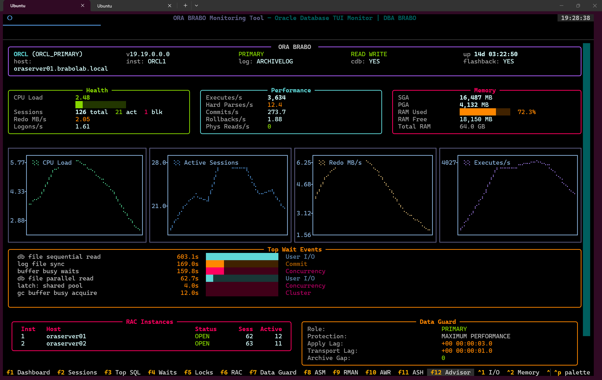

---

### 👥 Sessions Monitor (F2)
> Monitor completo de sessões com `GV$SESSION`: SID, Serial#, Username, Status, Event, Wait Class, SQL ID, Machine, Program e sessões bloqueadoras em vermelho. Suporte a Kill `[K]`, Trace `[T]`, Detail `[D]` e filtro `[/]`.

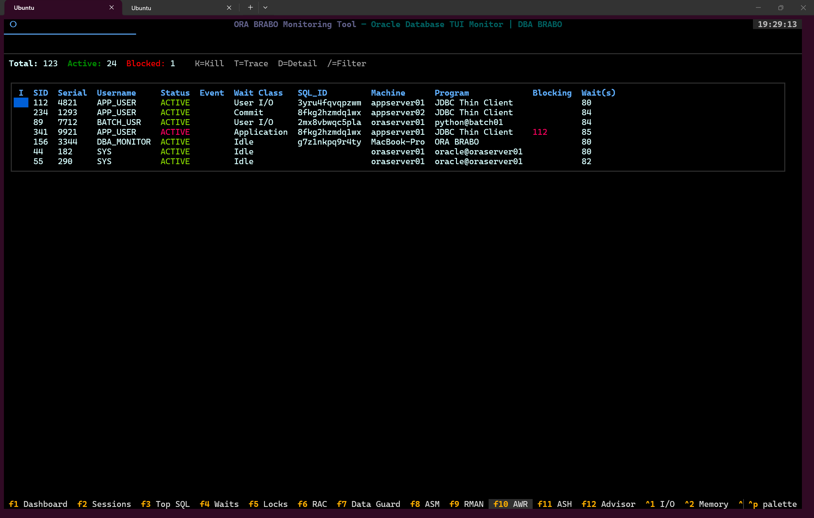

---

### 🔍 Top SQL por CPU (F3)
> Top SQL rankeado por consumo de CPU com gráficos em tempo real de CPU Seconds, Elapsed e Buffer Gets. Tabela com SQL_ID, Schema, Execuções, CPU%, Buffer Gets, Disk Reads e preview automático do SQL text ao navegar.

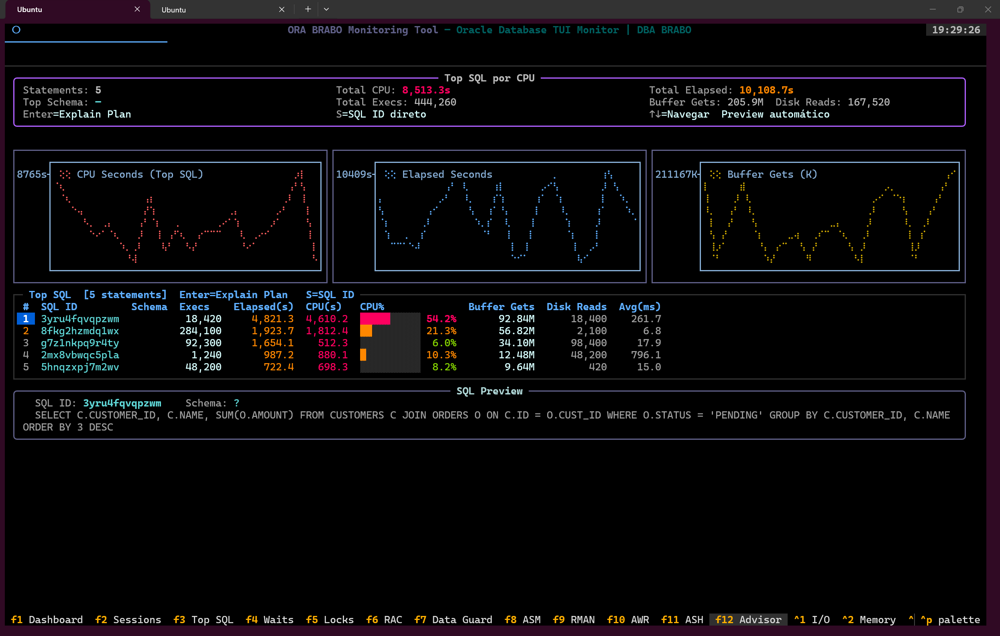

---

### ⏱️ Wait Event Monitor (F4)
> Monitor completo de wait events: gráficos de Top Wait Event, Non-Idle Total e Active Wait Sessions. Tabela com Event, Wait Class, Time(s), Avg(ms), Total Waits e % Non-Idle. Wait Class Summary com distribuição visual.

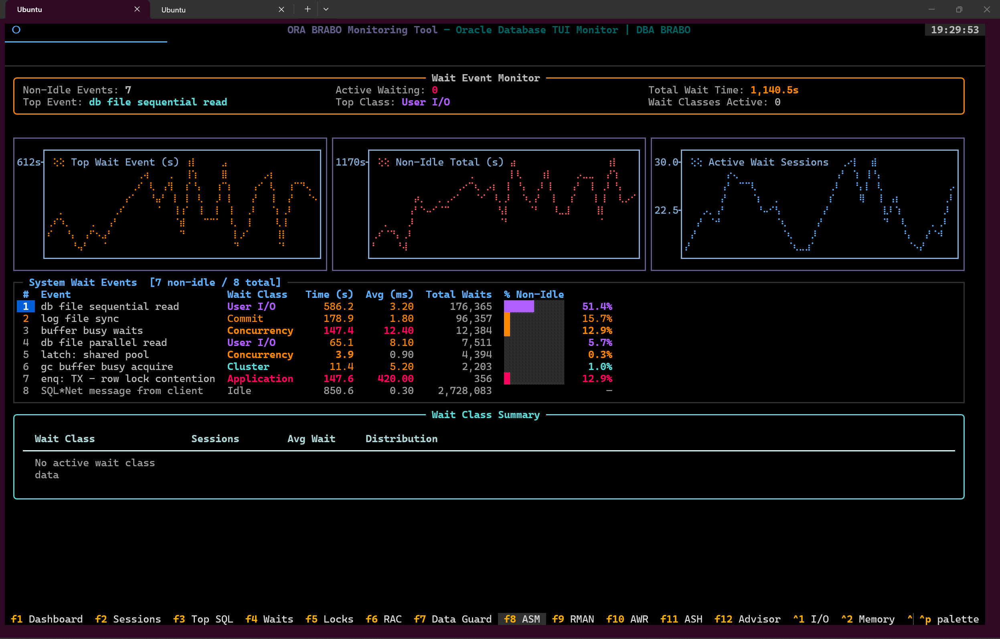

---

### 🔒 Lock Monitor (F5)
> Monitoramento avançado de bloqueios com drill-down completo: tabela de blockers com Kill Command pronto, painel do bloqueador com DATABASE INFORMATION, TIME LOCK em segundos, SQL_ID, objetos bloqueados (TABLE/INDEX com Lock Mode) e lista de waiters.

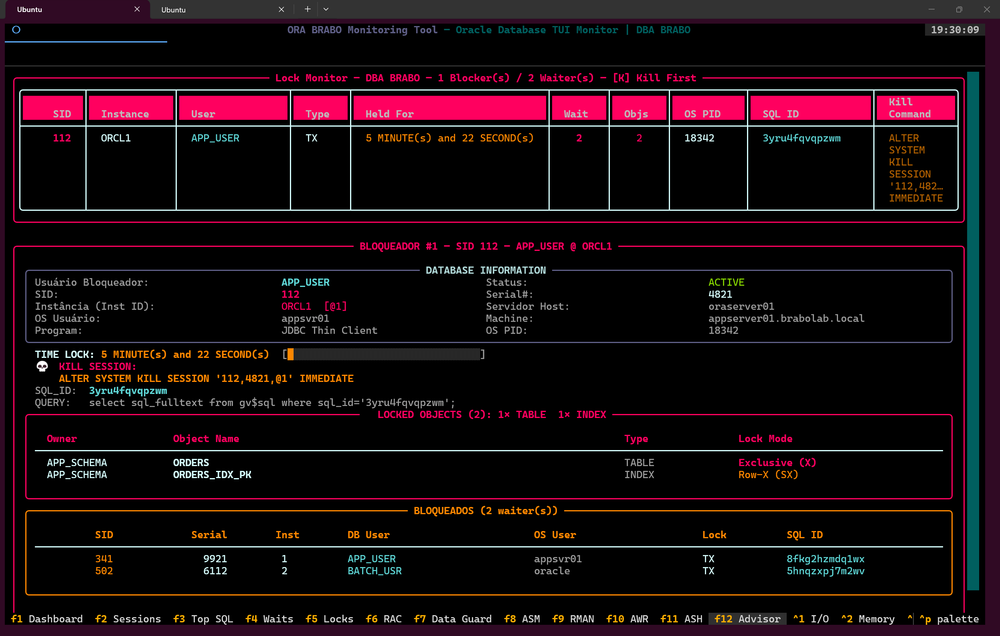

---

### 🏗️ RAC Cluster Monitor (F6)
> Visão completa do ambiente RAC: instâncias com Interconnect IP, Status, Sessions e GC Latency. Painel de RAC Services com Status/Goal por instância. Cache Fusion/GC Statistics com CR Blocks e Current Blocks por instância. Active Cluster Sessions com sessões bloqueadoras destacadas.

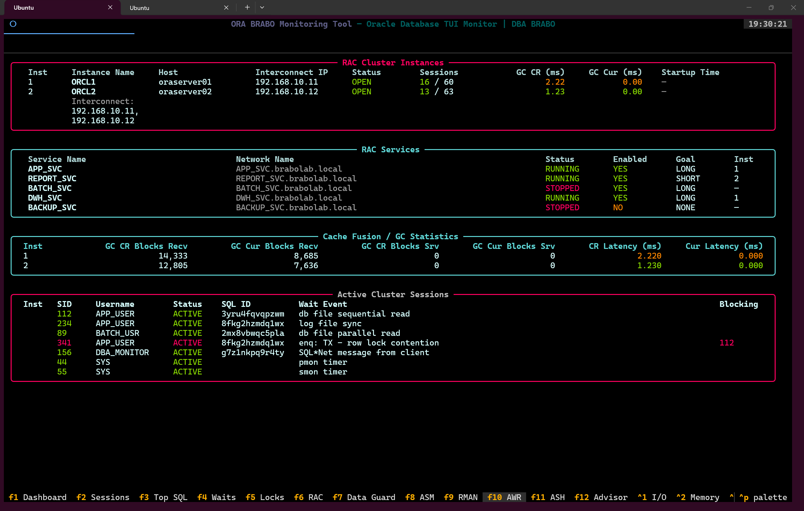

---

### 🛡️ Data Guard Monitor (F7)
> Monitoramento completo de Data Guard: Role, Protection Mode, Primary/Standby DB e Hosts, Apply Lag, Transport Lag, Redo Rate e Archive Gap. Archive Gap Monitor em tempo real. Standby Processes (MRP/RFS/ARCH) com Status, Thread, Sequence. RAC Standby Processes por instância via GV$.

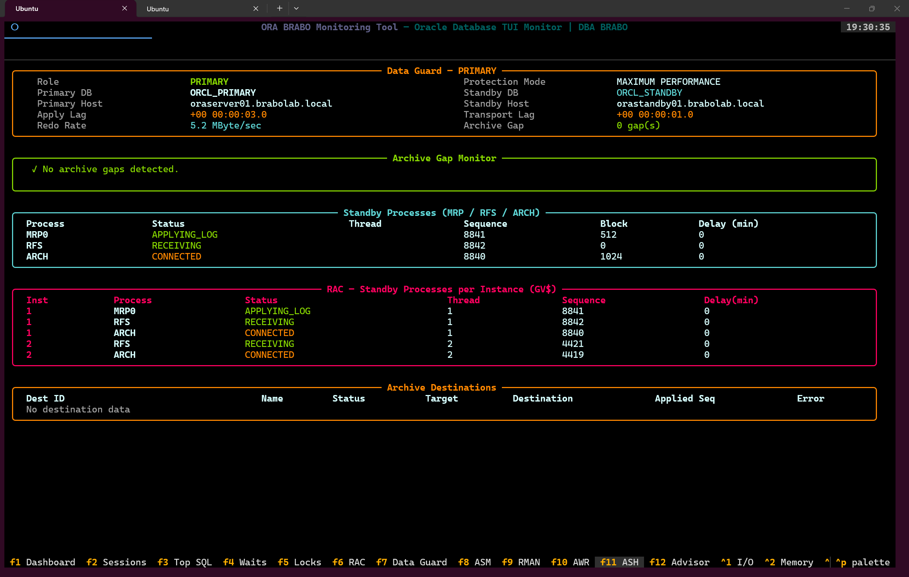

---

### 💽 ASM Storage Monitor (F8)
> Storage Capacity Overview com barras de uso por diskgroup (DATA/FRA/RECO). ASM Diskgroups com Type, State, Total/Free/Used%. ASM Disks per Diskgroup com Path, Failgroup, R-ms e W-ms por disco. Fast Recovery Area com Archive Rate e forecast. Top Database Objects by Size.

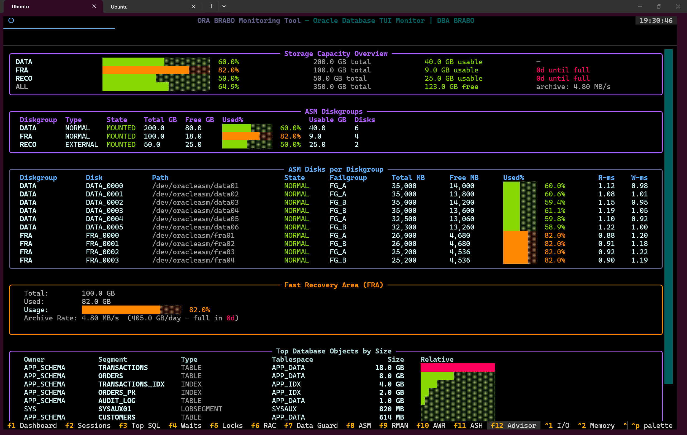

---

### 📊 Tablespaces & AWR (F10)
> Tablespaces com barras coloridas de uso % (verde/amarelo/vermelho), AutoExtend e Status. AWR Top SQL by Elapsed Time com SQL Text preview. AWR Top Wait Events da última hora. Instance Activity Metrics: DB Time, CPU, Redo, Transactions, Executes, Physical I/O.

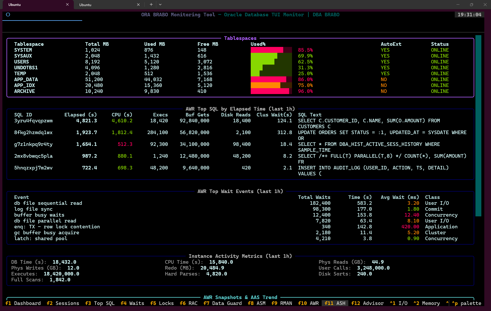

---

### 💾 RMAN Monitor (F9)
> Monitor completo de backup RMAN em tempo real: Active Sessions com canal e elapsed. Channel Progress via `V$SESSION_LONGOPS` com progresso %, MB/s e ETA. Wait Events das sessões RMAN. Disk I/O Async com arquivo sendo processado. Overall Performance Summary. Backup Growth Chart com histórico de 7 dias.

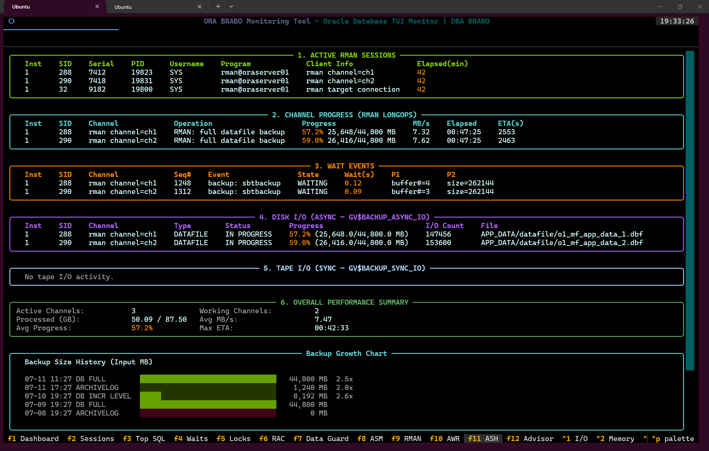

---

### 🕐 ASH — Active Session History (F11)
> ASH Activity Summary com top events dos últimos 120 samples e barras de distribuição. Tabela de samples com Sample Time, Inst, SID, SQL_ID, Event, Wait Class, State e Module — dados direto de `DBA_HIST_ACTIVE_SESS_HISTORY`.

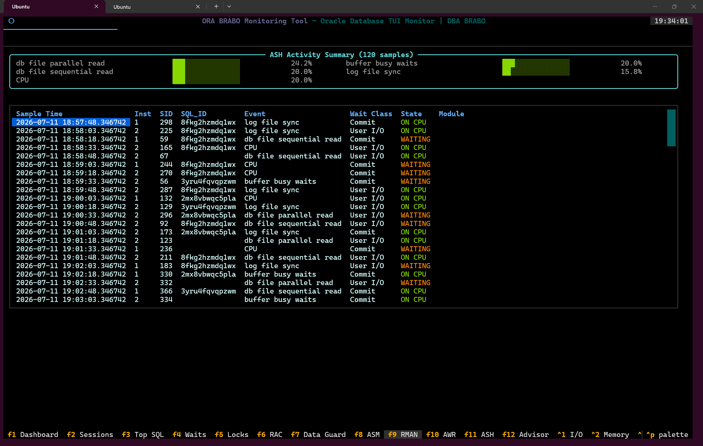

---

### 🧠 ORA BRABO Advisor (F12)
> Engine de análise contínua e automática com findings CRITICAL/WARNING/INFO: Top SQL consumindo CPU, Tablespace crítico, Row Lock Contention, RMAN failure, PGA elevado. Oracle Advisor Framework com status de ADDM, SQL Tuning Advisor, SGA/PGA Advisor, Segment Advisor e mais. Advisor Findings & Recommendations do ADDM.

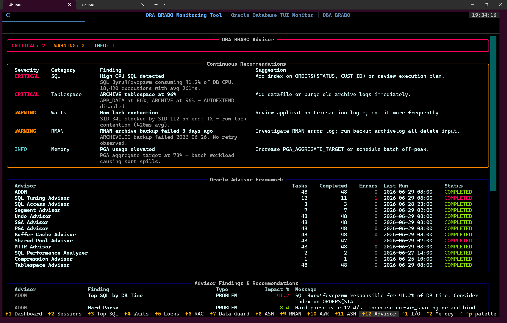

---

### ⚡ I/O Activity Monitor (^1)
> I/O Activity total com Top File e Top Function. I/O by Datafile com Reads, Writes, Read/Write MB e latência Avg R(ms)/W(ms) por arquivo. I/O by Function (DBWR, LGWR, Archiver, SQL, Buffer Cache). Load Profile dos últimos 60s via `V$SYSMETRIC`. Redo Log Groups com Status, Sequence e Members.

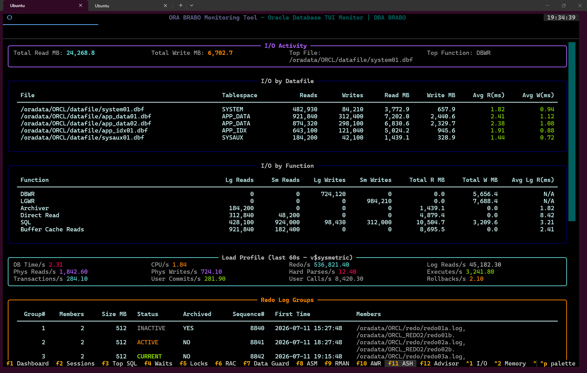

---

### 📝 Redo & Undo Monitor
> Load Profile completo com DB Time/s, CPU/s, Redo/s, Transactions/s, Hard Parses, Executes. Redo Log Groups com Status INACTIVE/ACTIVE/CURRENT, Archived e Members. Redo Switches per Hour das últimas 24h. Undo Stats via `V$UNDOSTAT` com Undo Blocks, Transactions, ORA-01555 e No Space.

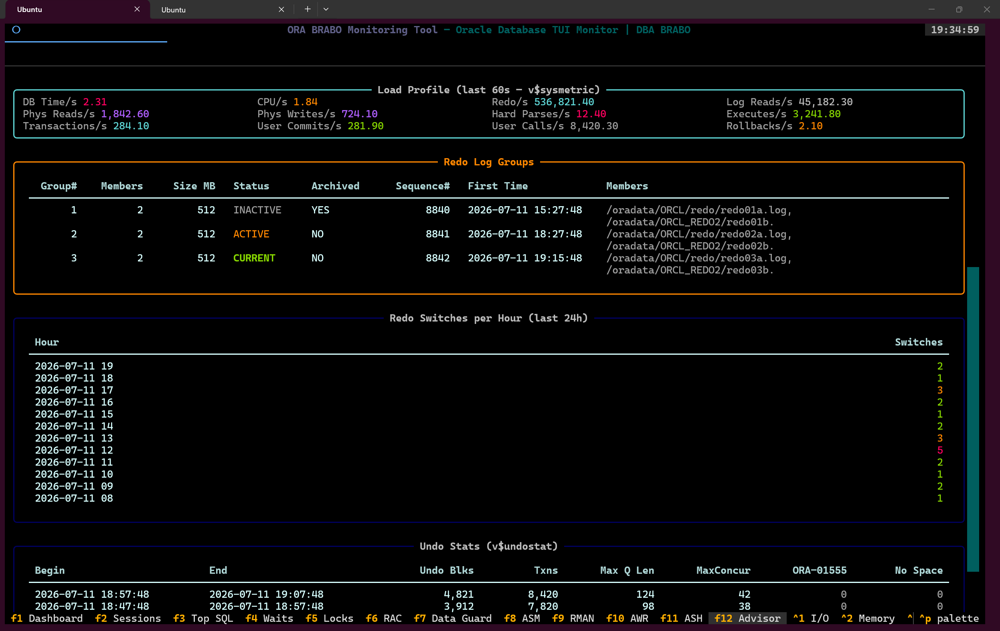

---

### 🧮 Memory Advisor (^2)
> Memory Advisor com SGA Size, PGA Target, Buffer Cache Hit% e PGA Cache Hit%. SGA Target Advice com simulação de DB Time e Est. Physical Reads para diferentes tamanhos. PGA Target Advice com Est. Hit% e Overalloc por tamanho. Buffer Pool Statistics. Recent SGA/PGA Resize Operations.

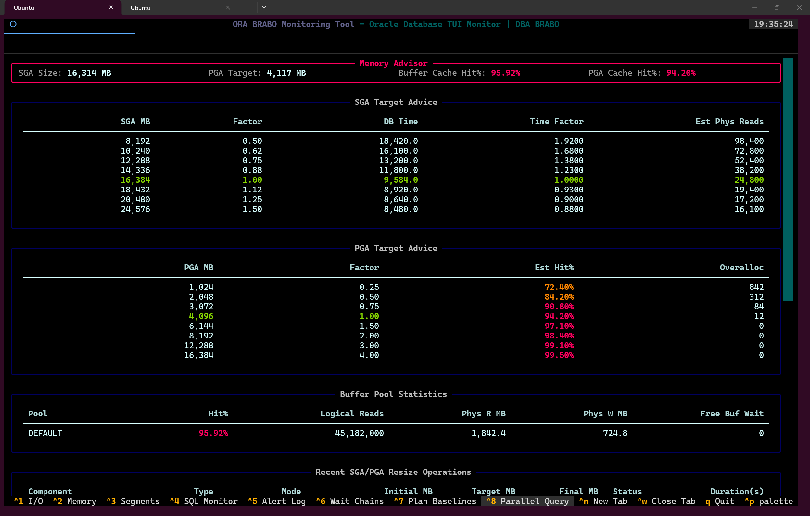

---

### 🔩 Latches & Mutexes
> Buffer Pool Statistics com Hit%, Logical Reads, Physical R/W MB e Free Buf Waits. Recent SGA/PGA Resize Operations com Component, Type, Mode, Initial/Target/Final MB e Duration. Top Latches by Sleeps com Gets, Misses, Miss%, Sleeps e Wait ms. Mutex Sleep top 10 com Location e Wait ms.

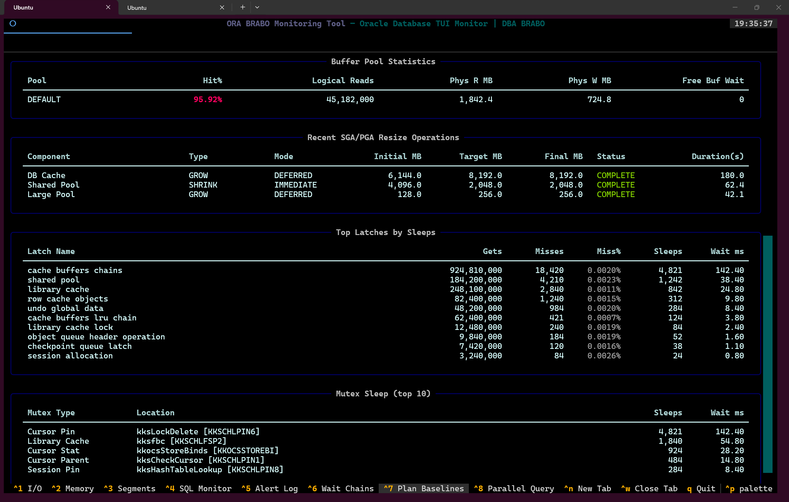

---

### 📦 Segments & Objects (^3)
> Segments & Objects com Stale Stats, Sched Failures e PX Sessions. Top Segments por logical reads (filtráveis por teclas 1-5). Stale/Missing Object Statistics com Days Old, DML Since e flag Stale. Scheduler Jobs com State, Next Run, Run Count e Failures. Failed Job Run History com Error# e Info.

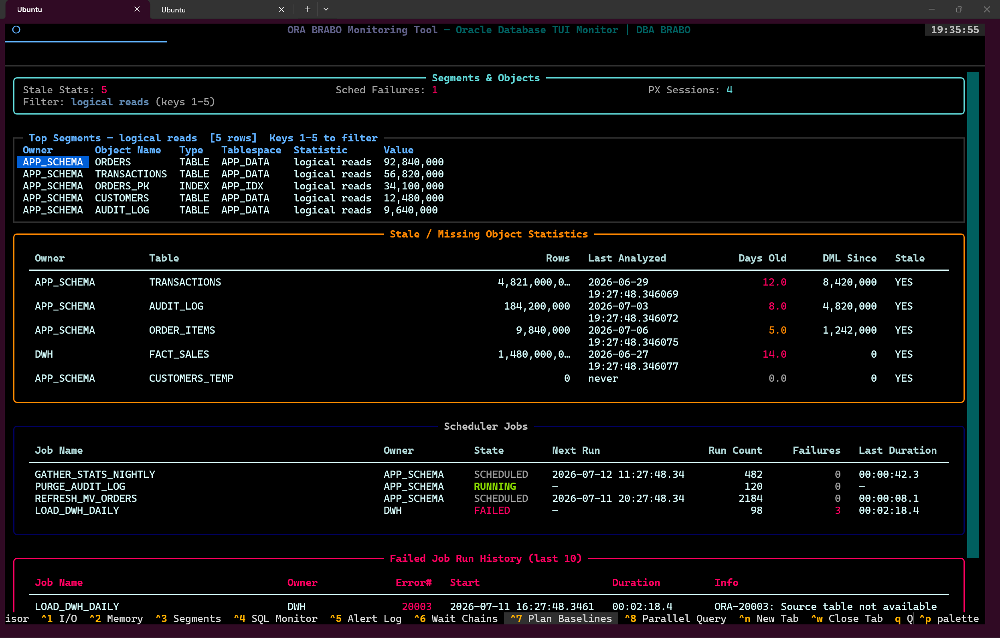

---

### 🔬 Real-Time SQL Monitor (^4)
> Real-Time SQL Monitor via `GV$SQL_MONITOR`: SQLs EXECUTING e DONE com SID, SQL ID, Status colorido, User, Elapsed(s), CPU(s), Buffer Gets, Disk Reads, PX Req/Alloc e preview do SQL Text. Drill-down com Enter para SQL text completo.

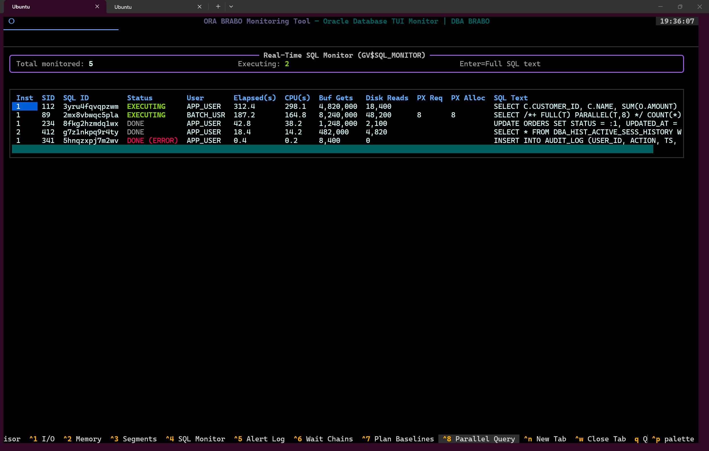

---

### 🚨 Alert Log Monitor (^5)
> Alert Log Monitor em tempo real: Incidents, Alert entries e Last ORA-. Tabela com Timestamp, Level (ERROR/CRITICAL), Component, Host, Instance e Message completo — incluindo ORA-00060, ORA-04031, ORA-01555, ORA-00600, ORA-07445. Incidents/Problems Summary com Problem Key, Incident ID, Count e Last Time.

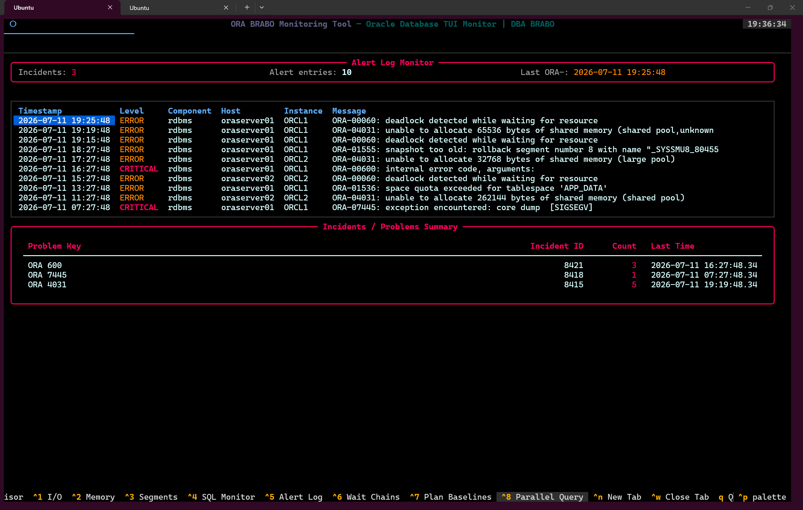

---

### ⛓️ Wait Chains (^6)
> Wait Chains via `V$WAIT_CHAINS`: detecção de cadeias de bloqueio com identificação de deadlocks (cycles). Visualização em árvore da chain completa: SID, PID, tempo de espera em segundos e evento — mostrando a hierarquia exata de quem está bloqueando quem.

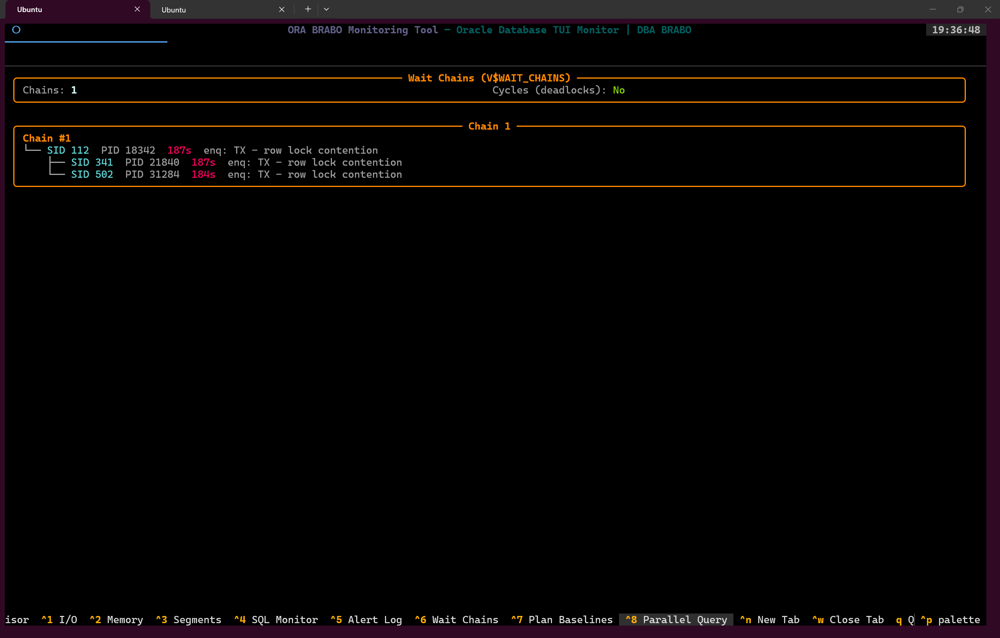

---

### 📋 SQL Plan Baselines (^7)
> SQL Plan Management via `DBA_SQL_PLAN_BASELINES`: Total Baselines, Fixed e Not Reproduced. Tabela com SQL Handle, Plan Name, Schema, Accepted, Fixed, Enabled, Reproduced, Execuções, Elapsed(s) e Last Executed — controle completo de planos fixados.

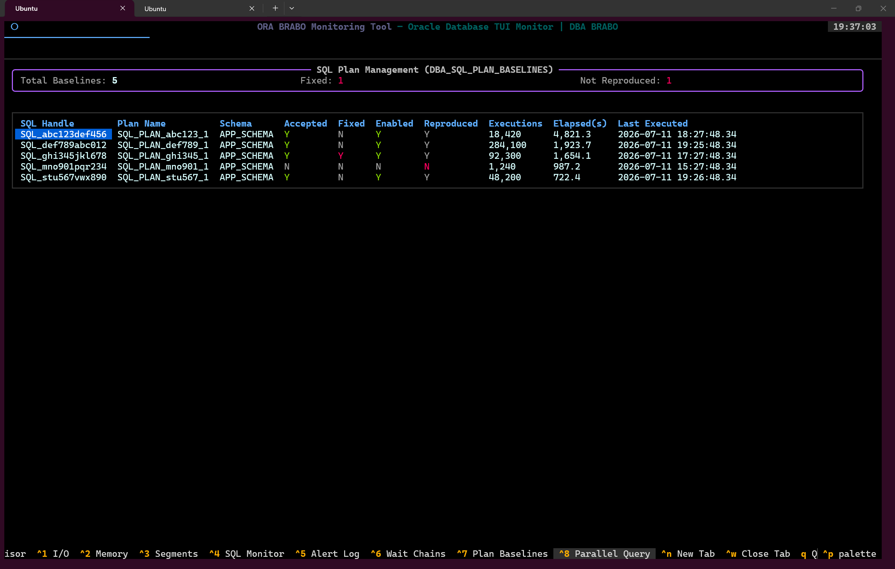

---

### ⚙️ Parallel Query Monitor (^8)
> Parallel Query Monitor via `GV$PX_SESSION`: Total PX Sessions, Active Coordinators e Total Slaves. Tabela com Inst, SID, Serial#, Username, Status, Req DOP, Act DOP (em vermelho quando degradado), Slave Sets, PX Req/Alloc, SQL ID e Wait Event em tempo real.

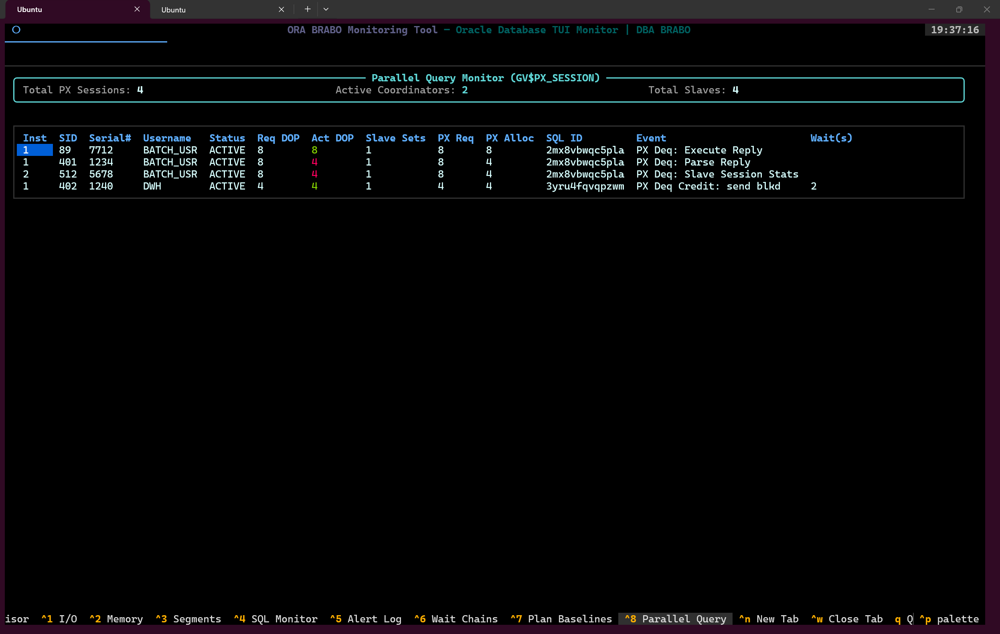

---

### 🚀 Exadata Overview
> Exadata Monitor com DB Nodes e Storage Cells. Smart Scan %, Storage Index %, Offload Efficiency %, Flash Cache Hit % com barras visuais. I/O Stats: Eligible GB, Returned via IB, Saved by Storage Index, Flash Cache Hits. Cell Servers com IP, Interconnect IP, Status e Version. Top SQLs por Offload Efficiency %.

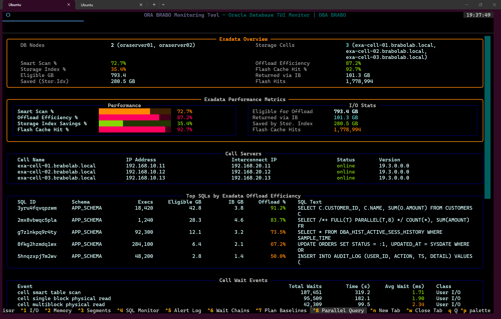

---

### 🔋 Exadata Detail
> Exadata detalhado: Top SQLs por Offload Efficiency com Eligible GB, IB GB e Offload %. Cell Wait Events com Total Waits, Time(s) e Avg Wait(ms). HCC Compressed Objects (Hybrid Columnar Compression) com Compression type, Rows, Size MB. Exadata Database Parameters: cell offload settings, parallel_degree_policy, heat_map.

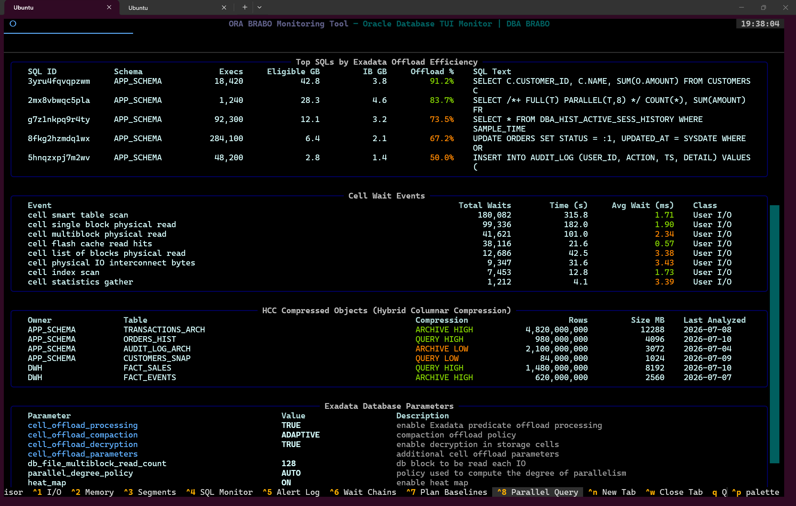

---

## Bancos e Ambientes Suportados

| Versão | Suporte |
|--------|---------|
| Oracle 11g R2 | ✅ |
| Oracle 12c R1/R2 | ✅ |
| Oracle 18c | ✅ |
| Oracle 19c | ✅ (recomendado) |
| Oracle 21c | ✅ |
| Oracle 23ai | ✅ |
| Single Instance | ✅ |
| RAC | ✅ |
| Data Guard | ✅ |
| ASM | ✅ |
| CDB/PDB | ✅ |
| Exadata | ✅ |

---

## Instalação

**Requisitos:** Python 3.12+ · Sem Oracle Client (usa Thin Mode)

```bash
# Clonar
git clone https://github.com/acaciolr/-ora-brabo.git
cd -ora-brabo

# Criar ambiente virtual
python3 -m venv .venv
source .venv/bin/activate

# Instalar dependências
pip install -r requirements.txt
```

**Dependências:**
```
oracledb>=2.0.0    # Oracle Thin Mode — sem Oracle Client instalado
textual>=0.52.0    # TUI framework
rich>=13.7.0       # Renderização visual
```

---

## Uso

```bash
# Single Instance
python app.py --host 192.168.1.10 --port 1521 --service ORCL \
              --user system --password SenhaAqui --refresh 5

# Como SYSDBA
python app.py --host localhost --service ORCL \
              --user sys --password SenhaAqui --sysdba

# Alias recomendado (~/.bashrc)
alias ora-brabo='source ~/ora-brabo/.venv/bin/activate && cd ~/ora-brabo && python app.py'
```

---

## Navegação por Teclado

### Painéis principais
| Tecla | Painel |
|-------|--------|
| `F1` | Dashboard |
| `F2` | Sessions |
| `F3` | Top SQL |
| `F4` | Wait Events |
| `F5` | Lock Monitor |
| `F6` | RAC Cluster |
| `F7` | Data Guard |
| `F8` | ASM Storage |
| `F9` | RMAN |
| `F10` | AWR / Tablespaces |
| `F11` | ASH |
| `F12` | Advisor |

### Sub-painéis (Ctrl)
| Tecla | Painel |
|-------|--------|
| `^1` | I/O Activity |
| `^2` | Memory Advisor |
| `^3` | Segments & Objects |
| `^4` | SQL Monitor |
| `^5` | Alert Log |
| `^6` | Wait Chains |
| `^7` | Plan Baselines |
| `^8` | Parallel Query |

### Ações
| Tecla | Ação |
|-------|------|
| `K` | Kill Session |
| `T` | Trace Session |
| `E` | Explain Plan |
| `D` | Session Detail |
| `S` | SQL ID direto |
| `/` | Filtrar |
| `Q` | Sair |

---

## Arquitetura

```
ora_brabo/
├── app.py                    # Entry point — OraBraboApp (Textual)
├── core/
│   ├── config.py             # AppConfig dataclass
│   ├── connection_manager.py # Pool async oracledb Thin Mode
│   ├── cache.py              # MetricsCache com ring-buffer e TTL
│   └── scheduler.py          # Async scheduler — collectors em paralelo
├── collectors/               # 9 collectors independentes (async)
│   ├── health.py             # CPU, memória, SGA, PGA, rates
│   ├── sessions.py           # GV$SESSION completo
│   ├── sql.py                # Top SQL, explain plan, SQL monitor
│   ├── waits.py              # GV$SYSTEM_EVENT, wait classes
│   ├── rac.py                # GV$INSTANCE, GC stats, interconnect
│   ├── dg.py                 # Data Guard stats, MRP/RFS, gaps
│   ├── asm.py                # ASM diskgroups, FRA
│   ├── rman.py               # Jobs ativos, histórico
│   └── awr.py                # Snapshots, ADDM, ASH, tablespaces
├── widgets/
│   └── panels.py             # 24 painéis Textual
├── advisor/
│   └── engine.py             # AdvisorEngine: regras, Severity, Finding
└── shell/
    ├── collect_rac.sh        # srvctl / crsctl → JSON
    ├── collect_dg.sh         # dgmgrl show configuration
    └── collect_asm.sh        # asmcmd lsdg
```

**Diferenciais de arquitetura:**
- **Zero Oracle Client** — conecta via `oracledb` Thin Mode direto do Python
- **Async nativo** — collectors rodam em paralelo sem bloquear a UI
- **Ring-buffer de métricas** — 120 pontos históricos por métrica para gráficos em tempo real
- **Cache com TTL** — cada dado tem TTL independente (health=5s, SQL=10s, AWR=60s)
- **RAC-aware** — detecção automática, usa `GV$` quando disponível
- **Exadata-aware** — detecção automática de Cell Servers e Smart Scan

---

## Roadmap

- [x] Dashboard com Health, RAC, Data Guard, FRA e gráficos em tempo real
- [x] Sessions Monitor com Kill/Trace
- [x] Top SQL com Explain Plan e SQL Preview
- [x] Wait Event Monitor com gráficos
- [x] Lock Monitor com drill-down completo
- [x] RAC Cluster Monitor com Cache Fusion stats
- [x] Data Guard Monitor com MRP/RFS
- [x] ASM Storage Monitor com discos individuais
- [x] RMAN Monitor com progresso em tempo real
- [x] AWR / ADDM / ASH / Tablespaces
- [x] Advisor Engine com regras automáticas
- [x] I/O Activity Monitor
- [x] Memory Advisor (SGA/PGA Target Advice)
- [x] Segments & Objects com Stale Stats
- [x] Real-Time SQL Monitor
- [x] Alert Log Monitor
- [x] Wait Chains (V$WAIT_CHAINS)
- [x] SQL Plan Baselines
- [x] Parallel Query Monitor
- [x] Exadata (Smart Scan, Offload, HCC, Cell Wait Events)
- [ ] Tela de login interativa com histórico de conexões
- [ ] PDB Monitoring (CDB)
- [ ] Suporte multi-banco simultâneo
- [ ] Exportação de relatórios (AWR HTML, CSV)
- [ ] Modo cliente/servidor (monitorar centenas de bancos)

---

## Contribuindo

Pull requests são bem-vindos. Para mudanças grandes, abra uma issue primeiro.

```bash
git checkout -b feature/minha-feature
git commit -m "feat: descrição da feature"
git push origin feature/minha-feature
```

**Padrões do projeto:**
- Python 3.12+ com tipagem completa
- PEP8 + docstrings
- SQL compatível com Oracle 11g (sem `FETCH FIRST`)
- Testar em Single Instance antes de RAC

---

## Licença

MIT License — veja [LICENSE](LICENSE)

---

<div align="center">

Feito com ☕ e muito `V$SESSION` por **DBA BRABO**

*Se essa ferramenta te salvou de um incidente às 3h da manhã, deixa uma ⭐*

</div>